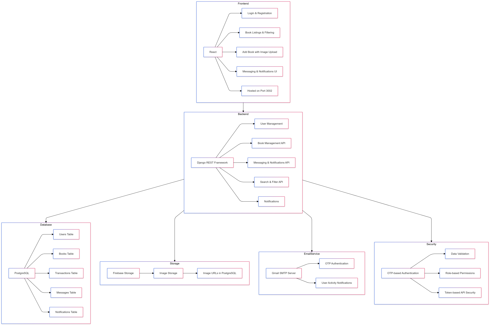
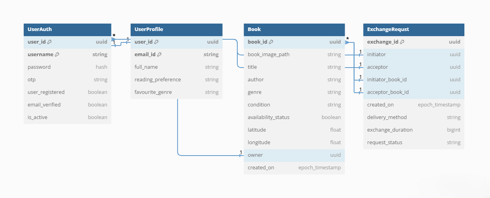
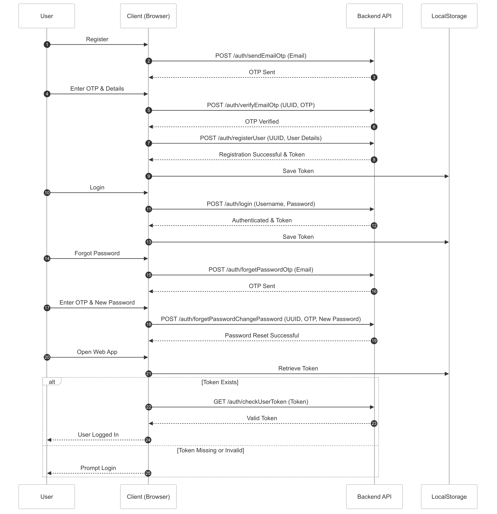

# Design Document

## Project Overview

**Project**: BookTrade

**Objective**: To create a digital platform enabling book enthusiasts to exchange, lend, and borrow books. The platform will feature user authentication, book listing, search, and exchange request functionalities, making it easy for users to connect and share books.

## Table of Contents
1. [Architecture Overview](#architecture-overview)
2. [Frontend Design](#frontend-design)
3. [Backend Design](#backend-design)
4. [Database Schema](#database-schema)
5. [API Endpoints](#api-endpoints)
6. [Scalability and Modularity](#scalability-and-modularity)
7. [User Flows](#user-flows)
8. [Wireframes](#wireframes)

---

## 1. Architecture Overview

The application follows a **modular full-stack architecture**:
- **Frontend**: Developed with React JS, enabling a component-based structure for reusability and modularity.
- **Backend**: Built using Django (with DjangoRestfulFramework), with RESTful API endpoints for each core feature.
- **Database**: Using [PostgreSQL], structured to support user authentication, book listings, search criteria, and transaction management.

**High-Level Architecture Diagram**:


---

## 2. Frontend Design

The frontend is structured using React components for key features:
- **User Authentication**: Login, registration, and account management components.
- **Book Listing**: Components for adding, viewing, and editing book details.
- **Search and Filter**: Search bar and filter options based on genre, location, etc.
- **Exchange Requests**: Interface for sending, receiving, and managing exchange requests.

**Component Hierarchy**:
- `App`: Main application wrapper
  - `Auth`
    - `Login`
    - `Register`
  - `Book`
    - `BookList`
    - `BookDetails`
    - `AddBook`
  - `Search`
    - `SearchBar`
    - `FilterOptions`
  - `Transaction`
    - `ExchangeRequest`
    - `TransactionHistory`

---

## 3. Backend Design

The backend provides RESTful endpoints for each user story:
- **User Authentication**: Endpoints for registration, login, password reset, and session management.
- **Book Listing Management**: CRUD operations for books, allowing users to list, edit, and delete book entries.
- **Search and Filter**: Endpoints for searching books with parameters like title, genre, location, and availability.
- **Exchange Requests**: Routes to handle sending, modifying, and managing exchange requests between users.

**Folder Structure**:
```
src/
|-- controllers/
|-- models/
|-- routes/
|-- services/
|-- middlewares/
|-- config/
```

---

## 4. Database Schema

The database is designed to store users, book listings, exchange transactions, and messaging records.

**Schema Diagram**:


**Core Tables**:
1. **Users**: Stores user details and authentication info.
2. **Books**: Stores details of books available for exchange or lending.
3. **ExchangeRequests**: Tracks the exchange process, including terms and negotiation history.
4. **Messages**: Stores user messages related to book exchanges.
5. **TransactionHistory**: Logs all completed transactions for users.

---

## 5. API Endpoints

A summary of key endpoints. Full documentation is available in the `integration` folder.

### User Authentication
- `POST /api/auth/register`: Register a new user
- `POST /api/auth/login`: Login user
- `POST /api/auth/reset-password`: Reset password

### Book Listing
- `POST /api/books`: Add a book listing
- `GET /api/books`: Retrieve books with filters
- `PUT /api/books/:id`: Edit a book listing
- `DELETE /api/books/:id`: Delete a book listing

### Search and Filter
- `GET /api/books/search?query=<query>&filters=<filters>`: Search books with various filters

### Exchange Requests
- `POST /api/exchange/request`: Send an exchange request
- `PUT /api/exchange/:id`: Modify an exchange request
- `DELETE /api/exchange/:id`: Cancel an exchange request

---

## 6. Scalability and Modularity

The application is designed with scalability and future expansion in mind:
- **Modular Codebase**: Both frontend and backend are separated into self-contained modules for reusability.
- **Scalable Database**: Designed to handle multiple user interactions and large datasets, with indexes on frequently searched fields.
- **API-Driven**: Backend APIs can serve other clients (e.g., mobile apps) independently of the frontend.
- **Load Handling**: Can be scaled horizontally to distribute traffic load across multiple servers.

---

## 7. User Flows

- **Registration Flow**: Guides the user from registration to email verification and account activation.
- **Book Listing Flow**: Enables users to add books to their profile and make them searchable to others.
- **Exchange Request Flow**: Allows users to send exchange requests and view the status in their transaction history.



---

## 8. Wireframes

The core UI wireframes for the platform have been created in Figma, covering:
1. **Login/Registration Pages**
2. **Book Listing Page**
3. **Book Search and Filter Page**
4. **Exchange Request Management**

<https://www.figma.com/design/MsFXEmVuk1SBz2lM5LRrjW/Booktrade?node-id=0-1&t=GmbT3PuNQiVYRA25-1>


---

### Notes
- For detailed API documentation, refer to the `README.md` in the **integration** folder.
- Postman Collection for API testing is also available in the **integration** folder.

--- 
